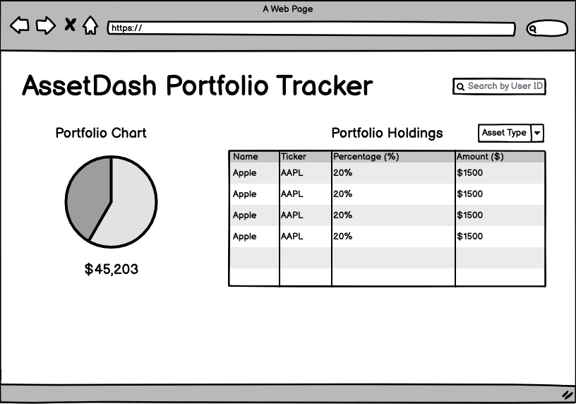

# AssetDash Frontend Engineering Take-home test

Our mission at AssetDash is to help users track the assets in their portfolio from many different sources.

In this exercise, you will be fetching from an API and rendering components to create a screen within our React application. An important module at AssetDash is the portfolio tracking tool,
which pulls in and calculates the user's portfolio holdings across different asset types and displays this to them on the web or in the mobile app.

Please read the instructions below and complete the task at your own pace. It should not take longer than 1 hour for
you to complete the frontend assignment.

## Frontend
Task: You have been provided a backend API and a boilerplate new React project. You will create the screen below by fetching data from the API provided and using any React libraries you would like.



Notes
- You can use any React libraries
- If there are any custom instructions for how to run the app please provide them to me so I may run it

UI elements:
- Title - "AssetDash Portfolio Tracker"
- Search bar for User ID
- Portfolio Chart
    - Pie chart showing the breakdown of assets by `type`
- Portfolio Holdings
    - Listview/table showing the list of assets by `type`

UX:
- Screen initially will appear empty since there is no User ID in the search bar
- If you search by User ID in the search bar it should fetch from the endpoints you created in the backend part
- Display the chart using any graphing library you like
- Display the list of holdings as either a table or a listview
- The "Asset Type" dropdown should default to "All" which means no filter.
- When a user change the dropdown it should query the holdings endpoint and filter by `asset type`

Bonus points for making the app look pretty with a nice graphing library styles :)

#### API Endpoint
- Fetch User data API endpoint. This API is passed a `user_id` (string) and returns a JSON array of the list of holdings for that user.

#### Endpoints
- User portfolio holdings endpoint (UserID ranges from 1-20)
    - GET request
    - URL `https://624760d3229b222a3fcc6155.mockapi.io/api/v1/portfolio/[user_id]`
    - E.g., `https://624760d3229b222a3fcc6155.mockapi.io/api/v1/portfolio/2`
    - Query Params
        - `user_id`: `str`
    - Response
        - Return a list of the user's holdings in descending order by value.
        - Example response:
        ```
         [
            {
                "ticker": "AAPL",
                "name": "Apple",
                "type": "stock",
                "value": 1000,
            },
            ...
         ]
        ```
